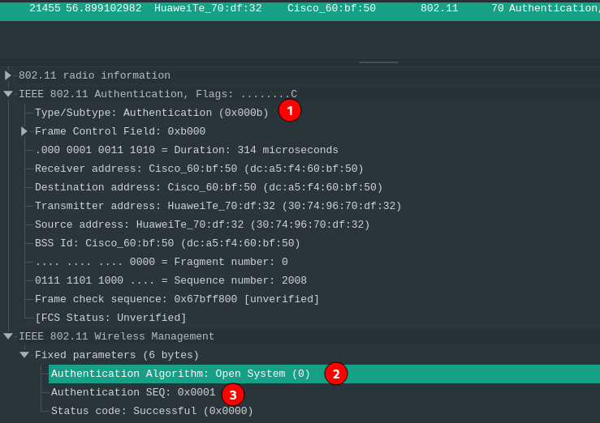
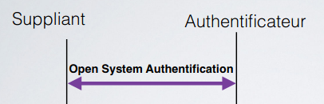
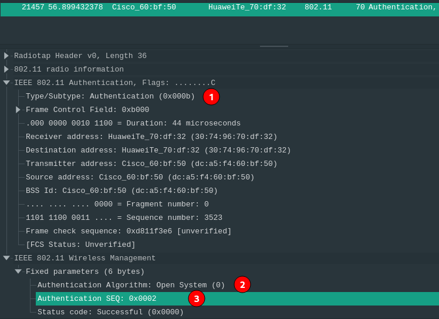

- [Livrables](#livrables)

- [Échéance](#%c3%89ch%c3%a9ance)

- [Quelques éléments à considérer](#quelques-%c3%a9l%c3%a9ments-%c3%a0-consid%c3%a9rer-pour-les-parties-2-et-3)

- [Travail à réaliser](#travail-%c3%a0-r%c3%a9aliser)

# Sécurité des réseaux sans fil

## Laboratoire 802.11 Sécurité WPA Entreprise

__A faire en équipes de deux personnes__

### Objectif :

1.	Analyser les étapes d’une connexion WPA Entreprise avec une capture Wireshark
2.	__(optionnel)__ Implémenter une attaque WPE (Wireless Pwnage Edition) contre un réseau WPA Entreprise
1.  __(optionnel)__ Implémenter une attaque GTC Dowgrade contre un réseau WPA Entreprise


## Quelques éléments à considérer pour les parties 2 et 3 :

Les parties 2 et 3 sont optionnelles puisque vous ne disposez pas forcement du matériel nécessaire pour les réaliser.

En principe, il devrait être possible de démarrer vos machines en Kali natif (à partir d'une clé USB, avec une distro live par exemple) ou d'employer une autre version de Linux. Si vous n'avez pas une interface WiFi USB externe, __vous ne pouvez pas faire ces parties dans une VM Linux__. 

Dans le cas où vous arriverais à tout faire pour démarrer un Linux natif, il existe toujours la possibilité que votre interface WiFi ne puisse pas être configurée en mode AP, ce qui à nouveau empêche le déroulement des parties 2 e 3.

Ces deux parties sont vraiment intéressantes et __je vous encourage à essayer de les faire__, si vous avez les ressources. Malheureusement je ne peux pas vous proposer un bonus si vous les faites, puisqu'il risque d'y avoir des personnes qui n'auront pas la possibilité de les réaliser pour les raisons déjà expliquées.

Si vous vous lancez dans ces deux parties, voici quelques informations qui peuvent vous aider :

- Solution à l’erreur éventuelle « ```Could not configure driver mode``` » :

```
nmcli radio wifi off
rfkill unblock wlan
```
-	Pour pouvoir capturer une authentification complète, il faut se déconnecter d’un réseau et attendre 1 minute (timeout pour que l’AP « oublie » le client) 
-	Les échanges d’authentification entreprise peuvent être facilement trouvés utilisant le filtre d’affichage « ```eap``` » dans Wireshark


## Travail à réaliser

### 1. Analyse d’une authentification WPA Entreprise

Dans cette première partie, vous allez analyser [une connexion WPA Entreprise](files/auth.pcap) avec Wireshark et fournir des captures d’écran indiquant dans chaque capture les données demandées.

- Comparer [la capture](files/auth.pcap) au processus d’authentification donné en théorie (n’oubliez pas les captures d'écran pour illustrer vos comparaisons !). En particulier, identifier les étapes suivantes :
	
	Nous avons regardé l'échange entre `Cisco_60:bf:50` qui est l'Authentificateur et `HuaweiTe_70:df:32` qui joue le rôle de Suppliant. 
	
	- Requête et réponse d’authentification système ouvert
	
	  
	
	  Qui correspond à cette phase de l'authentification
	
	  
	
	  Et comme réponse de l'authentificateur on voit que le numéro de séquence (3) à augmenté. 
	
	  
	
  - Requête et réponse d’association (ou reassociation)

  

  Et les paquets dans la captures sont les suviants : 

  D'abord la reassocation request du suppliant vers l'authentificateur (il n'y a pas l'assocation dans la capture entre cet suppliant et cet aurthentificateur)

  

  Ensuite la reassocaition response de l'authentificateur vers le suppliant. 

  

  - Négociation de la méthode d’authentification entreprise

    

    On voit sur le screenshot : 

    * 1. L'authentificateur propose TLS (4.)

      2. Le suppliant refuse avec `Legacy Nak` (https://datatracker.ietf.org/doc/html/rfc3748)¨

         et lui propose d'utiliser Protected EAP

         

      3. L'authentificateur renvoie une requête en proposant (acceptant dans ce cas) PEAP. 

         

         

  - Phase d’initiation. Arrivez-vous à voir l’identité du client ?

    * 

       

      D'abord l'Authentificateur procède à la requête d'identité du suppliant, celui ci répond avec son identité (`joel.gonin`)

      Ceci correspond à cela dans les slides.

      

  - Phase hello :
  	
  	Ici cela correspond à cela : 
  	
  	
  	
  	D'abord le Client Hello avec les préférences du client, puis le serveur hello avec les réponses du serveur. 
  	
  	
  	
  	
  	
  	
  	
  	- Version TLS
  	
  	  On voit dedans la version de TLS utilisée (1) qui est 1.0, le suppliant propose aussi TLS 1.2 qui ne sera pas utilisé. Le serveur répond avec TLS 1.0 (1)
  	
  	- Suites cryptographiques et méthodes de compression proposées par le client et acceptées par l’AP
  	
  	  Les ciphers suites (5) et compression (6) méthode proposée par le client. Pour les ciphers il y'en a beaucoup (31 suites) par exemple :
  	
  	  
  	
  	  Et comme méthode de compression 
  	
  	  
  	
  	  Le client n'en propose pas (cela vient probablement du fait que TLS ne compresse plus)
  	
  	  Dans sa réponse `serveur hello`, le serveur choisit `TLS_RSA_WITH_AES_256_CBC_SHA`(5) ainsi que pas de méthode de compression (6).
  	
  	- Nonces dans le point 3 de la capture d'écran. 
  	
  	- Session ID dans le point 4 de la capture d'écran. 
  	
  - Phase de transmission de certificats

    

    Dans le paquet ` Handshake Protocol: Certificate` le serveur envoie au suppliant son certificat. 

   	- Echanges des certificats
  	- Change cipher spec
  	
  	  
  	
  	  
  	
  - Authentification interne et transmission de la clé WPA (échange chiffré, vu comme « Application data »)

    L'app data qui correspond à l'échange de la clef WPA. (1)

    

    

  - 4-way handshake

    Sur la capture ci-dessus en 2 le 4-way handshake. 

### Répondez aux questions suivantes :

> **_Question :_** Quelle ou quelles méthode(s) d’authentification est/sont proposé(s) au client ?
> 
> **_Réponse :_** Le serveur propose en premier EAP-TLS, celui ci refuse et renvoie qu'il aimerait EAP-PEAP et le serveur propose ensuite EAP-PEAP donc en tout EAP-TLS et EAP-PEAP sont proposés au client. 

---

> **_Question:_** Quelle méthode d’authentification est finalement utilisée ?
> 
> **_Réponse:_** EAP-PEAP (cf capture d'écran d'avant..)

---

> **_Question:_** Lors de l’échange de certificats entre le serveur d’authentification et le client :
>
> - a. Le serveur envoie-t-il un certificat au client ? Pourquoi oui ou non ?
>
> **_Réponse:_** Le serveur envoie son certificat. Pour que le client puisse l'authentifier. 
>
> - b. Le client envoie-t-il un certificat au serveur ? Pourquoi oui ou non ?
>
> **_Réponse:_** Non (pas dans EAP-PEAP). PEAP utilise un challenge response pour que le serveur puisse authentifier le client. Si c'était EAP-TLS alors le client enverrait un certficat au serveur. 

---

### 2. (__Optionnel__) Attaque WPA Entreprise (hostapd)

Les réseaux utilisant une authentification WPA Entreprise sont considérés aujourd’hui comme étant très surs. En effet, puisque la Master Key utilisée pour la dérivation des clés WPA est générée de manière aléatoire dans le processus d’authentification, les attaques par dictionnaire ou brute-force utilisés sur WPA Personnel ne sont plus applicables. 

Il existe pourtant d’autres moyens pour attaquer les réseaux Entreprise, se basant sur une mauvaise configuration d’un client WiFi. En effet, on peut proposer un « evil twin » à la victime pour l’attirer à se connecter à un faux réseau qui nous permette de capturer le processus d’authentification interne. Une attaque par brute-force peut être faite sur cette capture, beaucoup plus vulnérable d’être craquée qu’une clé WPA à 256 bits, car elle est effectuée sur le compte d’un utilisateur.

Pour faire fonctionner cette attaque, il est impératif que la victime soit configurée pour ignorer les problèmes de certificats ou que l’utilisateur accepte un nouveau certificat lors d’une connexion.

Pour implémenter l’attaque :

- Installer ```hostapd-wpe``` (il existe des versions modifiées qui peuvent peut-être faciliter la tâche... je ne les connais pas. Dans le doute, utiliser la version originale). Lire la documentation du site de l’outil ou d’autres ressources sur Internet pour comprendre son utilisation
- Modifier la configuration de ```hostapd-wpe``` pour proposer un réseau semblable au réseau de l’école ou le réseau de votre préférence, sachant que dans le cas d'une attaque réelle, il faudrait utiliser le vrai SSI du réseau de la cible
- Lancer une capture Wireshark
- Tenter une connexion au réseau (ne pas utiliser vos identifiants réels)
- Utiliser un outil de brute-force (```john```, par exemple) pour attaquer le hash capturé (utiliser un mot de passe assez simple pour minimiser le temps)

### Répondez aux questions suivantes :

> **_Question :_** Quelles modifications sont nécessaires dans la configuration de hostapd-wpe pour cette attaque ?
> 
> **_Réponse :_** 

---

> **_Question:_** Quel type de hash doit-on indiquer à john pour craquer le handshake ?
> 
> **_Réponse:_** 

---

> **_Question:_** Quelles méthodes d’authentification sont supportées par hostapd-wpe ?
> 
> **_Réponse:_**


### 3. (__Optionnel__) GTC Downgrade Attack avec [EAPHammer](https://github.com/s0lst1c3/eaphammer) 

[EAPHammer](https://github.com/s0lst1c3/eaphammer) est un outil de nouvelle génération pour les attaques WPA Entreprise. Il peut en particulier faire une attaque de downgrade GTC, pour tenter de capturer les identifiants du client en clair, ce qui évite le besoin de l'attaque par dictionnaire.

- Installer ```EAPHammer```. Lire la documentation du site de l’outil ou d’autres ressources sur Internet pour comprendre son utilisation
- Modifier la configuration de ```EAPHammer``` pour proposer un réseau semblable au réseau de l’école ou le réseau de votre préférence. Le but est de réaliser une GTC Downgrade Attack.
- Lancer une capture Wireshark
- Tenter une connexion au réseau


### Répondez aux questions suivantes :

> **_Question :_** Expliquez en quelques mots l'attaque GTC Downgrade
> 
> **_Réponse :_** 

---

> **_Question:_** Quelles sont vos conclusions et réflexions par rapport à la méthode hostapd-wpe ?
> 
> **_Réponse:_** 


## Livrables

Un fork du repo original . Puis, un Pull Request contenant :

-	Captures d’écran + commentaires
-	Réponses aux questions

## Échéance

Le 9 juin 2021 à 23h59
